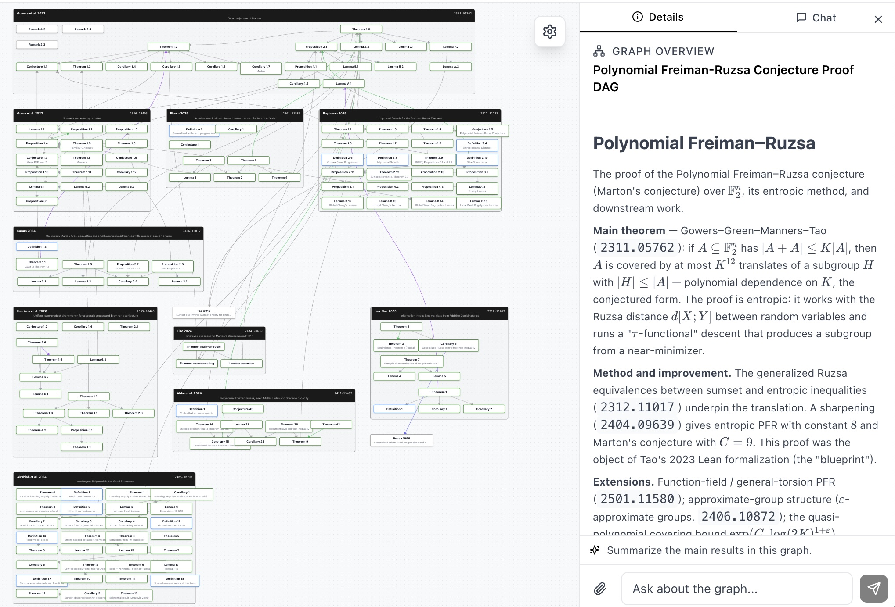
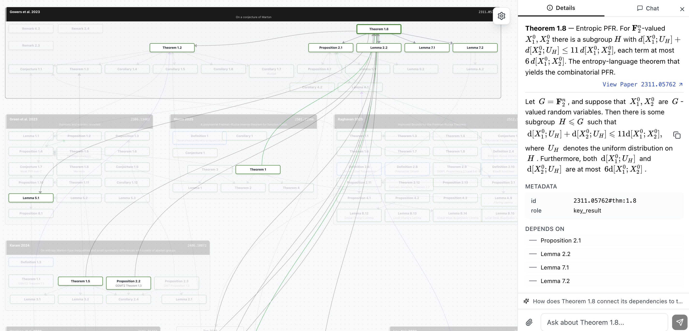

# Proof DAGs

**Typed proof dependency graphs over the math arXiv.** Each theorem, proposition, lemma, and definition in an indexed paper becomes a node with a stable ID (`thm:1.5`, `lem:4.7`); each typed edge (`improves`, `extends`, `imports_result`, `provides_input_to`, `addresses_same_question`, …) records how it depends on other results — within and across papers — at theorem granularity, with one-sentence source-grounded notes per edge.

Citation graphs say "paper A cited paper B." We say "Theorem 1.1 of A `improves` Lemma 5.1 of B" or "Theorem 1.3 of A `provides_input_to` Proposition 4.1 of B."

## Why this repo

Mathlib carries a machine-readable typed dependency graph — every Lean theorem records which lemmas its proof uses, and premise-selection and retrieval-augmented proving tools work over that structure. The arXiv literature has no equivalent. Citation graphs are paper-level and untyped: they record that paper A cites paper B, not whether B is a load-bearing input or a passing reference. Lean blueprints carry typed dependency structure at the right granularity, but each one covers a single proof being formalized.

This repo aims to create the same kind of structure, at the literature level: typed edges over theorems, lemmas, and definitions across 10 research programs of the math arXiv, at theorem granularity. Three of the programs are paired with live Lean blueprints (PFR, PNT+, Sphere-Packing-Lean) as external validation anchors.

## Try the interactive graphs

- 🌐 **Browse interactively:** **[sciencestack.ai/graph](https://sciencestack.ai/graph)** — this repository *is* the source data behind that viewer. Every node and edge you can click in the viewer corresponds to an entry in the JSON files here.

  <p align="center">
    <a href="https://www.sciencestack.ai/graph/pfr"></a>
    <a href="https://www.sciencestack.ai/graph/pfr"></a>
  </p>

  *Example: the [`pfr`](https://www.sciencestack.ai/graph/pfr) program. **Left:** 10 papers, each a cluster of theorem-level nodes, joined by typed cross-paper edges. **Right:** clicking Gowers–Green–Manners–Tao Thm 1.8 (Entropic PFR) highlights its dependencies — Prop 2.1, Lemmas 2.2, 7.1, 7.2 — traced across the program.*

- 📦 **Download:** clone this repo (CC-BY 4.0) — the full registry is ~5 MB of JSON across 10 programs.
- 🔌 **Query programmatically:** ScienceStack API and MCP endpoint at [sciencestack.ai/developers](https://sciencestack.ai/developers).
- 📄 **Status snapshot:** [`STATUS.md`](./STATUS.md) — current inventory and open audit items.
- 🐛 **Found a wrong edge?** Open an issue with the source quote — that's the highest-leverage contribution.

## Current state

10 research programs · 108 papers · ~1,850 theorem-level nodes · ~400 typed cross-paper edges (27 of them cross-program) · 3 anchored on Lean formalization blueprints.

| Program | Papers | Nodes | Subfield | Lean blueprint anchor |
|---|---:|---:|---|---|
| `nse-blowup` | 27 | 512 | PDE / Navier–Stokes blowup | — |
| `bourgain-demeter-decoupling` | 12 | 243 | harmonic analysis / decoupling | — |
| `perfectoid-spaces` | 11 | 227 | arithmetic geometry / p-adic Hodge | — |
| `maynard-small-gaps` | 15 | 210 | bounded gaps between primes | — |
| `pfr` | 10 | 146 | additive combinatorics | **Tao 2023 (PFR)** |
| `prime-number-theorem` | 7 | 143 | analytic number theory | **Kontorovich et al. (PNT+)** |
| `large-values-zero-density` | 6 | 110 | zero density of $\zeta$ | — |
| `sphere-packing` | 8 | 98 | discrete geometry / modular forms | **Birkbeck/Hariharan/Mehta/Lee (Sphere-Packing-Lean), final stages by Math, Inc. Gauss** |
| `langlands-local` | 6 | 88 | local Langlands | — |
| `kakeya-restriction` | 6 | 76 | harmonic analysis / Kakeya | — |

## Two connected regions

Cross-program edges (27 total) form two connected components:

**Arithmetic geometry** — `perfectoid-spaces` ↔ `langlands-local`, all into Fargues–Scholze (`2102.13459`).

**Harmonic analysis → analytic number theory** — `kakeya-restriction` ↔ `bourgain-demeter-decoupling` ↔ `large-values-zero-density` ↔ `prime-number-theorem` ↔ `maynard-small-gaps`. Joined by, among others, a load-bearing `2006.08250v1:thm:1.3 provides_input_to 1311.4600v3:prop:4.1` edge (equidistribution → Maynard–Tao sieve). Five DAGs in one walkable component.

The remaining DAGs (`nse-blowup`, `pfr`, `sphere-packing`) are standalone islands — densely internally connected, no cross-DAG edges out.

## Layout and where to start

```
<topic>/
├── SUMMARY.md       # ← START HERE: prose overview of the program
├── manifest.json    # title, tags, paper roles, foundational refs, Lean blueprint anchor (if any)
├── papers/          # ← the data: per-paper DAGs
│   └── <arxiv_id>.json
├── graph.json       # cross-paper and cross-DAG edges
├── index.json       # extraction status and node/edge counts per paper
└── queue.json       # extraction work queue (mostly empty)
```

**For a human reader:** open `<topic>/SUMMARY.md` for the program-level story.
**For an agent / programmatic consumer:** `manifest.json` (program metadata) and `papers/*.json` (per-paper DAGs) are the structured data; `graph.json` is the cross-paper edge list; the rest is operational.

## Schema

A per-paper file `<topic>/papers/<arxiv_id>.json` has the shape:

```json
{
  "paper": "1603.04246v2",
  "title": "The sphere packing problem in dimension 8",
  "authors": ["Maryna Viazovska"],
  "status": "complete",
  "nodes": {
    "thm:3": {
      "type": "Theorem",
      "number": "3",
      "section": "1",
      "role": "key_reduction",
      "summary": "Existence of the magic function for $E_8$: ..."
    }
  },
  "edges": [
    { "from": "thm:1", "to": "thm:3", "type": "depends_on", "note": "..." }
  ],
  "critical_path": ["thm:1", "thm:3", "thm:4", "prop:1"],
  "proof_architecture": { "magic_function": { "description": "...", "nodes": ["thm:3", "thm:4"] } },
  "bibliography": { "ElkiesCohn": { "arxiv_id": "math/0110009", "in_registry": true } }
}
```

- **Node IDs** are paper-local: `thm:1.5`, `lem:4.7`, `prop:2.1`, `def:1`, `conjecture:3`. They mirror the printed paper's numbering.
- **Intra-paper edges** (inside one paper) use bare node IDs in `from`/`to`.

A cross-paper edge in `<topic>/graph.json` looks like:

```json
{
  "from": "2006.08250v1:thm:1.3",
  "to": "1311.4600v3:prop:4.1",
  "type": "provides_input_to",
  "note": "Maynard III's equidistributed minorant supplies the level-of-distribution beyond 1/2 that the Maynard–Tao sieve consumes."
}
```

- Cross-paper edges use **prefixed string IDs** `<arxiv_id>:<node_id>` (so the full ID has two colons: one separating arxiv-id from node-id, one inside the node-id).
- If `<arxiv_id>` belongs to a different DAG, the edge is **cross-DAG** — these are the structural links between programs.

`manifest.json` describes the program: title, tags, the papers (with one-sentence roles), foundational pre-arXiv references, related DAGs, and (if applicable) the Lean blueprint anchor for the program.

## Typed edge vocabulary

| Edge type | Meaning |
|---|---|
| `improves` | Sharpens a numerical bound or quantitative rate |
| `extends` | Adds new cases / weakens a hypothesis without changing the framework |
| `extends_to_new_setting` | Lifts a result to a different domain (number fields, function fields, etc.) |
| `generalizes` | Abstracts a result so the predecessor is a special case |
| `transliterates` | Verbatim translation to a new setting (same proof, ideals replacing integers) |
| `re_derives` | Same conclusion, restated cleanly |
| `imports_result` | Cites another paper's theorem verbatim as a baseline |
| `removes_hypothesis` | Same conclusion without an assumption the predecessor needed |
| `synthesizes` | Combines two parallel-discovery branches into a unified result |
| `method_pivot` | Same author / technique, repurposed to a different (often opposite) problem |
| `alternative_engine` | Same goal, structurally different machinery |
| `parallel_result` / `parallel_mechanism` | Independent simultaneous proofs of the same theorem |
| `provides_input_to` | One paper's theorem is another paper's hypothesis |
| `shared_tool` / `shared_mechanism` | Common technical lemma or method |
| `abstracts` | Lifts a specific result to an abstract version usable beyond the original |
| `companion_result` | Sister papers in a series, attacking the same question from different angles |
| `addresses_same_question` | Conceptual overlap without direct logical dependency |
| `depends_on` | Logical / proof-level dependency (intra-paper) |

## Lean blueprint anchors

Three programs are paired with live Lean blueprints. The blueprints serve as external ground truth — their statement-level dependency graphs are the precision/recall yardstick for our extracted nodes.

| Program | Blueprint | Subfield | Blueprint nodes | Status |
|---|---|---|---:|---|
| `pfr` | [PFR (Tao 2023)](https://teorth.github.io/pfr/blueprint/) | additive combinatorics | 218 | 16 in-scope chapter-level theorems map; full label-by-label table is an open audit item |
| `prime-number-theorem` | [PNT+ (Kontorovich et al.)](https://github.com/AlexKontorovich/PrimeNumberTheoremAnd) | analytic number theory | (not yet crawled) | classical-core layer matches stated scope; full table not yet built |
| `sphere-packing` | [Sphere-Packing-Lean](https://thefundamentaltheor3m.github.io/Sphere-Packing-Lean/blueprint/) | discrete geometry | 139 | One verified label match (Cohn–Elkies); Chapter 6/7 mapping not label-by-label verified. Final stages of the Lean formalization were completed by [Math, Inc.'s Gauss](https://www.math.inc/sphere-packing) autoformalization model |

## How the data is produced

Each DAG is **generated by Claude Opus 4.7** reading the source LaTeX content fetched via the public [ScienceStack API](https://github.com/sciencestack-ai/sciencestack-cli) under an explicit extraction discipline (verify arXiv IDs against titles before extraction; type each edge from the controlled vocabulary; read every edge as English to check direction; spot-verify numerical claims against the parsed source; prefer thematic edge types like `addresses_same_question` over load-bearing types like `depends_on` when uncertain). The maintainer reviews scope choices, edge directionality, and the final structure, and runs an integrity gate on every per-paper DAG (every edge resolves to a real node ID; critical path connected; KaTeX-clean summaries). This is the human–AI workflow the [proposal §3](https://github.com/sciencestack-ai/proof-dags#built-on) commits to scaling.

This is *not* formally verified data. Per the [`maynard-small-gaps`](./maynard-small-gaps/) audit, the empirical edge quality on the most-scrutinized DAG is:

- ~80% strong (directly verifiable from paper text)
- ~14% defensible but type or note imprecise
- ~5% wrong or misattributed
- ~8% missing (additive — would be added in a full pass)

Other DAGs are at the "verified-faithful structurally, not edge-audited" tier — `maynard-small-gaps` is the only one that has had the full expert pass. See [`STATUS.md`](./STATUS.md) for the current snapshot of open audit items.

If you find a wrong edge or missing dependency, **please open an issue with the source quote** — that's the highest-leverage contribution.

## For AI for math

This registry adds typed dependency labels for the informal arXiv literature — at the unit of a published theorem rather than a Lean term — alongside the dependency structure Mathlib already provides for *formal* mathematics. Three downstream tasks the data is shaped for:

- **Cross-paper premise selection.** Edges of types like `imports_result`, `provides_input_to`, and `depends_on` (when used across papers) are "$T$'s proof uses result $L$ of paper $P$" labels. A subset of the registry's 382 cross-paper edges falls into these load-bearing premise-style types; the rest carry other relationships (`improves`, `extends`, `addresses_same_question`, …) that are not premise-selection labels but are useful for other tasks. Complementary to Mathlib's ~100K exact internal premise labels — different unit (informal theorem vs Lean term), different scope (literature vs library).
- **Autoformalization grounding.** A cross-paper reference like "by Theorem 3.1 of [Author 1998]" resolves to a structured node with its upstream dependency chain visible — useful input for autoformalization tools that currently have to resolve such references from raw text or stub them.
- **Typed dependency prediction.** Given a new theorem, predict which prior results it uses *and how* (`improves` vs `imports_result` vs `addresses_same_question`, etc.). Citation prediction at the paper level is a known task; we're not aware of a comparable benchmark for typed prediction at the result level across the informal literature, and this registry is shaped to be one.

The closest precedent for typed proof-dependency graphs is the [Lean blueprint methodology](https://github.com/PatrickMassot/leanblueprint) (PFR, PNT+, Sphere-Packing-Lean, and others), which produces analogous typed-edge graphs but inside a *single* proof being formalized. The artifact here is the same shape at the *literature* level — validated against three Lean blueprints (see below) but not tied to active formalization.

## Also useful for working mathematicians

Queries citation graphs cannot answer:

- **Lineage with pinpoint specificity** — "How did Maynard's 600 bound get reduced to 246?" → a 4-edge chain with paper-level grounding.
- **Negative-space reasoning** — "What hasn't been improved since Polymath8b?" → enumerate edges *into* a node and check.
- **Transfer-of-technique** — filter edges by type ∈ {`method_pivot`, `transliterates`, `extends_to_new_setting`}.
- **Hypothesis routing** — "Where does my new BV-style result slot in?" → query nodes that *consume* level-of-distribution input.
- **What-if counterfactuals** — trace `depends_on` outward from a strengthened node before doing the work.

## License

CC-BY 4.0 (see [`LICENSE`](./LICENSE)). Suggested citation:

> ScienceStack proof-dags registry, https://github.com/sciencestack-ai/proof-dags.

## Reproducing or extending the data

Every node here corresponds to a math environment in an arXiv paper, addressable via the public [ScienceStack CLI](https://github.com/sciencestack-ai/sciencestack-cli) — so the *node substrate* (statements, sections, references, stable IDs like `thm:3`, `lem:4.7`) is reproducible by anyone, against the same backing index that powers [sciencestack.ai/graph](https://sciencestack.ai/graph):

```bash
pip install sciencestack
export SCIENCESTACK_API_KEY=...   # from sciencestack.ai

# Overview of an indexed paper (sections, math envs, etc.)
sciencestack --output json overview 1603.04246

# Fetch specific nodes by ID
sciencestack --output json nodes 1603.04246 --ids "thm:3,thm:4,prop:1"
```

What this repo *adds* on top of that substrate is the **curation**: which papers belong in which program, which edges between nodes are load-bearing, what type each edge carries (`improves`, `provides_input_to`, `addresses_same_question`, …), and the one-sentence source-grounded note per edge. Those judgments are produced by Claude Opus 4.7 reading the CLI-fetched paper content under the discipline described in [How the data is produced](#how-the-data-is-produced), and reviewed by the registry maintainer.

To **add a new program**: pick the papers, mirror the schema of an existing `<topic>/` folder, and assemble its `manifest.json` / `papers/*.json` / `graph.json` from CLI fetches. The schema above is the contract; PRs that follow it (and pass the integrity gate of every edge resolving to a real node ID) are welcome.

## Built on

- [ScienceStack](https://sciencestack.ai) — LaTeX-to-AST parser over 600K+ arXiv papers, providing the addressable node substrate (`paperId:thm:1.5`) every DAG node ties back to. Programmatic access via the [CLI](https://github.com/sciencestack-ai/sciencestack-cli) and [MCP endpoint](https://sciencestack.ai/developers).
- The Lean blueprint methodology pioneered by Patrick Massot's [`leanblueprint`](https://github.com/PatrickMassot/leanblueprint) and the formalization community around Mathlib.
